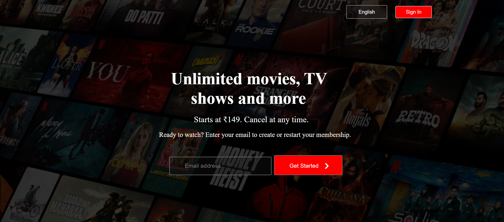

# Netflix-Clone
# 🎬 Netflix Clone

A responsive and visually appealing Netflix clone built using HTML, CSS, and JavaScript (or React – agar use kiya ho). This project mimics the design and UI/UX of the popular streaming platform Netflix, showcasing a homepage with hero banners, category sections, and hover effects.

## 🚀 Demo

👉 [Live Preview](https://isuumitt.github.io/Netflix-Clone/)

## 🖼️ Screenshots

## 🔧 Technologies Used

- HTML5
- CSS3 
- Responsive Design Technique

## 🎯 Features

- ✅ Fully responsive layout
- ✅ Hero banner section
- ✅ Movie/TV show thumbnails
- ✅ Hover animations
- ✅ Footer with useful links

